## Instruction for End Semester Examination Nov. 2020

### General

These instructions are in continuation to the instructions issued on Jan 04, 2020 under subject "INSTRUCTIONS for ONLNE REGULAR EXAMINATION w.e.f. 12th JAN 2021" on Notice Board of [https://apps.gndec.ac.in](https://apps.gndec.ac.in)

1. Examination will be of two hours duration, but students will get a window of THREE hours (10 am to 01.00 pm for the morning session and 02.00 pm to 05.00 pm for the evening session), so that if a student is unable to start an attempt at the scheduled time, still he / she will get 2 hours for the attempt. But no one will be able to attempt after the window of three hours is over.
1. In case of any delay related to the start of examination from the college side due to any reason (Internet / Server issue, etc.) due time will be given to the students.
1. College authorities will not be responsible for any internet problem at the student's end. Therefore, it is advised that every student must ensure a proper internet connection and appropriate device.
1. Examination will be proctored remotely using the Internet. It is advised to dress up properly and make sure no other person is accompanying the candidate during the examination, and the candidate is not permitted to:
   1. refer any help material (in any form) or
   1. consult any other person by any means of communication.

   Any violation of the conduct rules observed during proctoring will be treated as Unfair Means Case (UMC).
1. If due to some reason, any student is not able to start the examination, but otherwise, he is eligible to appear in the examination, then he / she need to inform the authorities by filling the `Help Form` from [https://gdy.club/exam](https://gdy.club/exam) or [https://forms.gle/KdRaUNxfFo4x4KSF8](https://forms.gle/KdRaUNxfFo4x4KSF8). Note that students have to fill the mentioned form ONLY. Telephonic communication of any kind will not be entertained to address issues during the examination time.
1. It is the sole responsibility of the student to provide correct and exact information asked in the `Help form`.
1. The students should check the date sheet of examinations uploaded on the website.

### Attempting ESE NOV-2020

For attempting the ESE NOV-2020 students have to follow the following steps very carefully:

1. Open [https://ese.gndec.ac.in](https://ese.gndec.ac.in]) from your Internet Access Device with webcam (you should have latest version of google chrome or Firefox browser installed on your devices).
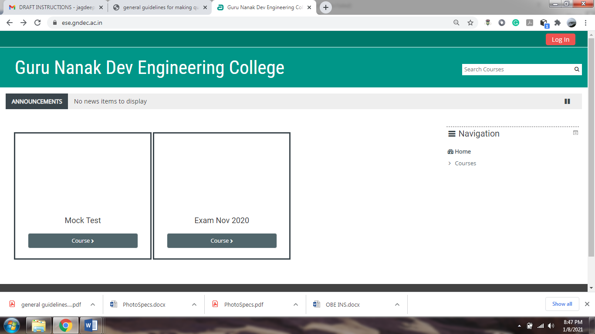
1. Login with your credentials as used in guru.gndec.ac.in for attending your classes.
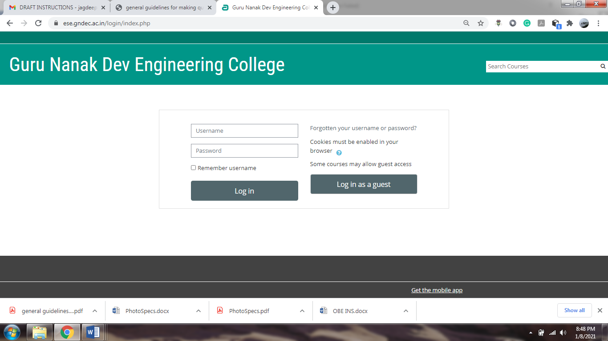
1. Select the TAB [My courses] -> exam-2020.
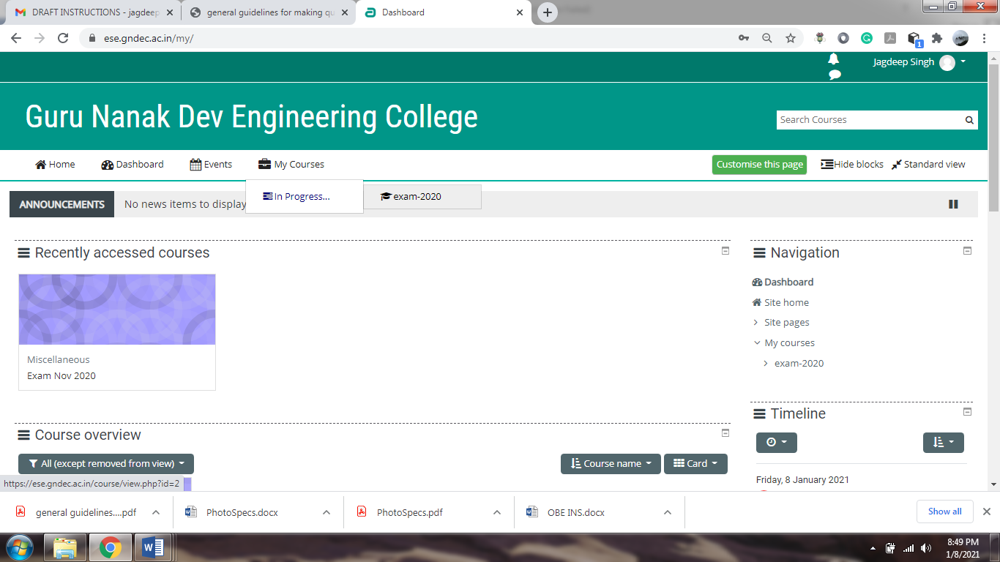
1. Select the quiz to attempt (instead of demo quiz you may find Mock test for mock exam and for final exam it will be your subject code/paper ID).
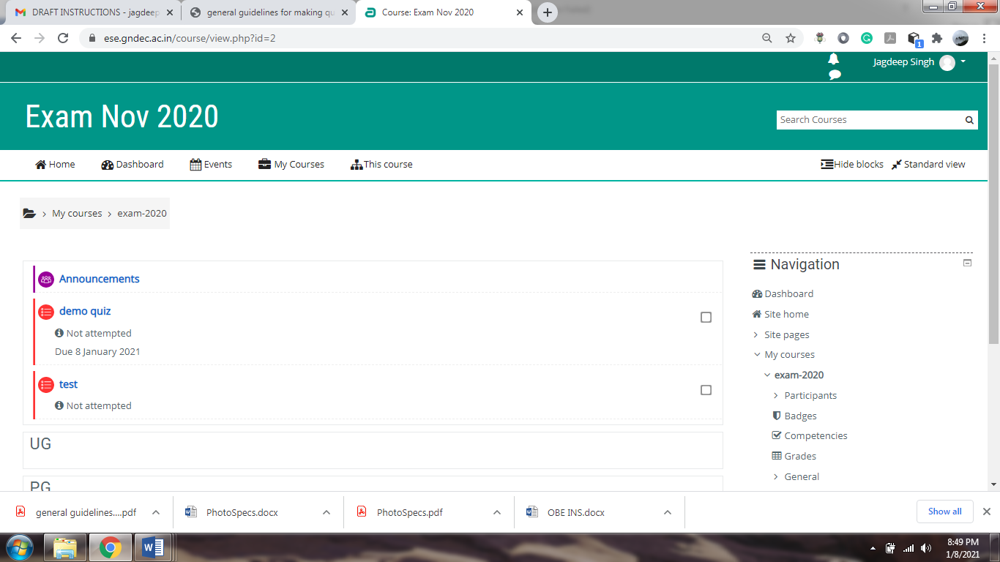
1. After selecting the quiz type you have to press the button [Attempt Quiz now].
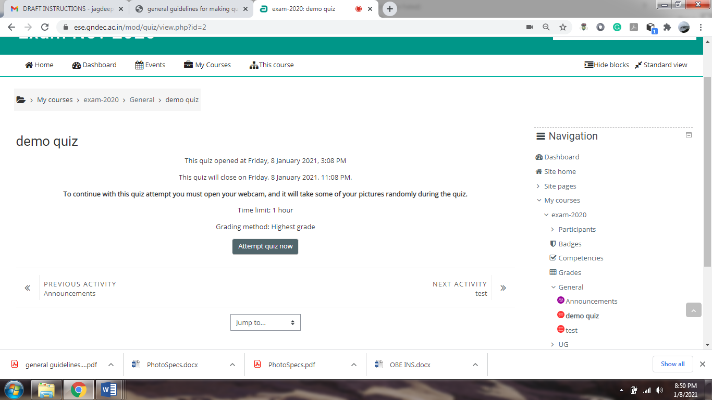
1. In the window, you get, you should have to ensure that your webcam is working properly and picture is clear like shown in below.
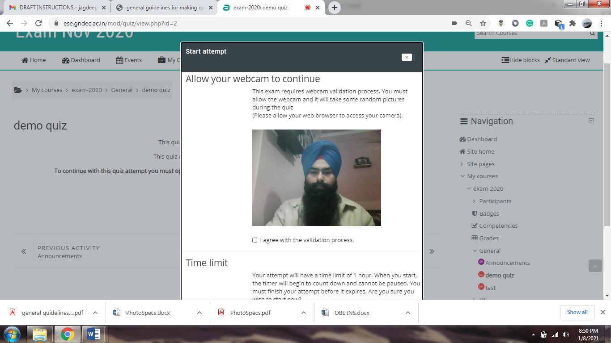
After setting the above said conditions scroll down the window, now tick mark on "I agree with the validation process" now press the tab start attempt.
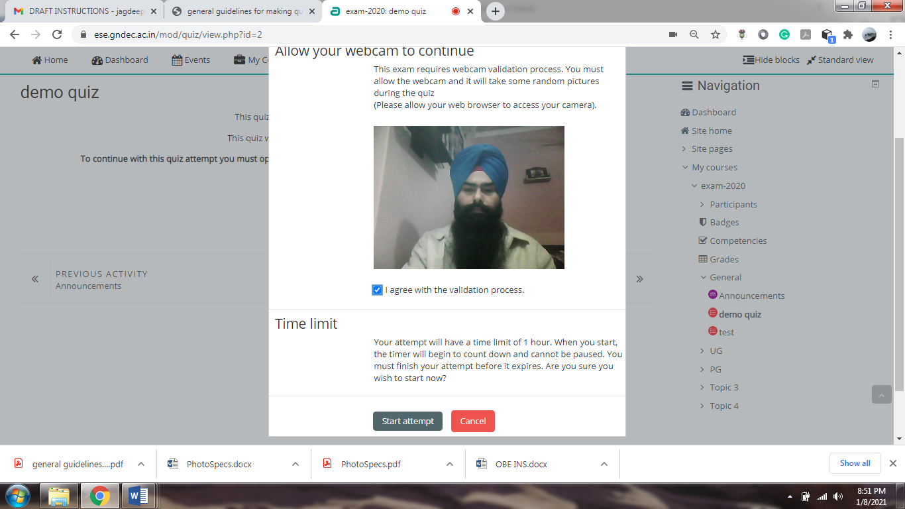
1. Now your exam is started attempt the question and press “next page” tab for second question.
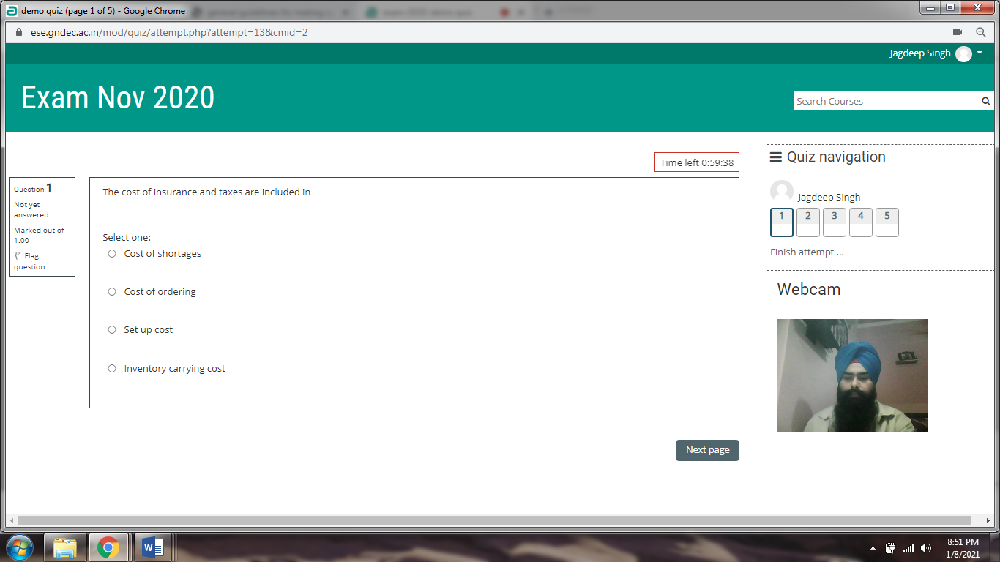
1. Keep an eye on the Timer displayed on the screen.
1. After attempting all the questions you should have to press "Finish attempt" tab.
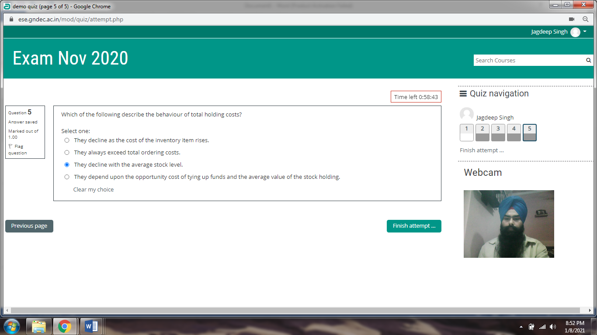
1. Now you should have to press the tab "Submit all and finish".
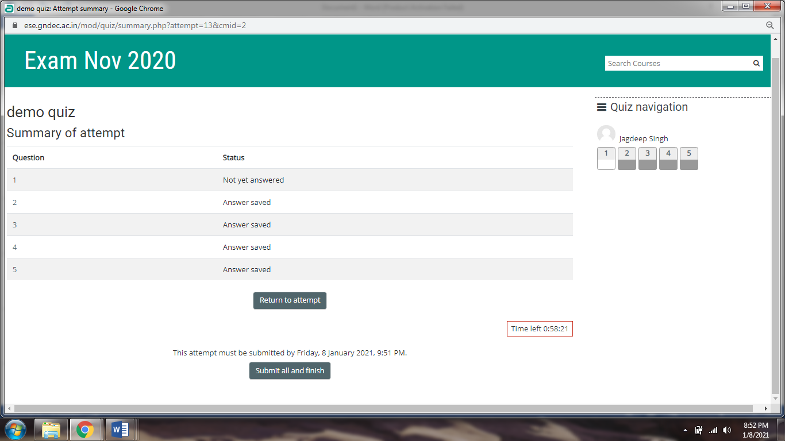
1. After that you get confirmation window, here you have to press the tab "submit all and finish".
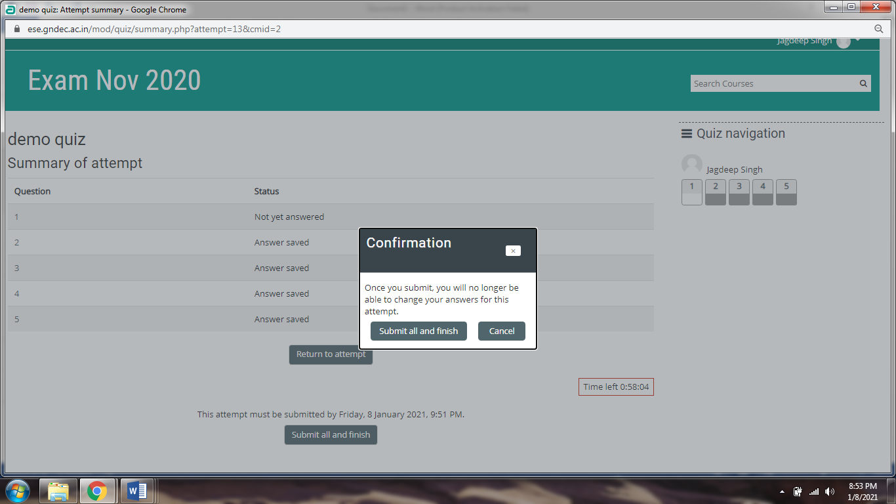
1. Now you will get the review option of your attempt at the last you have to press  finish review.
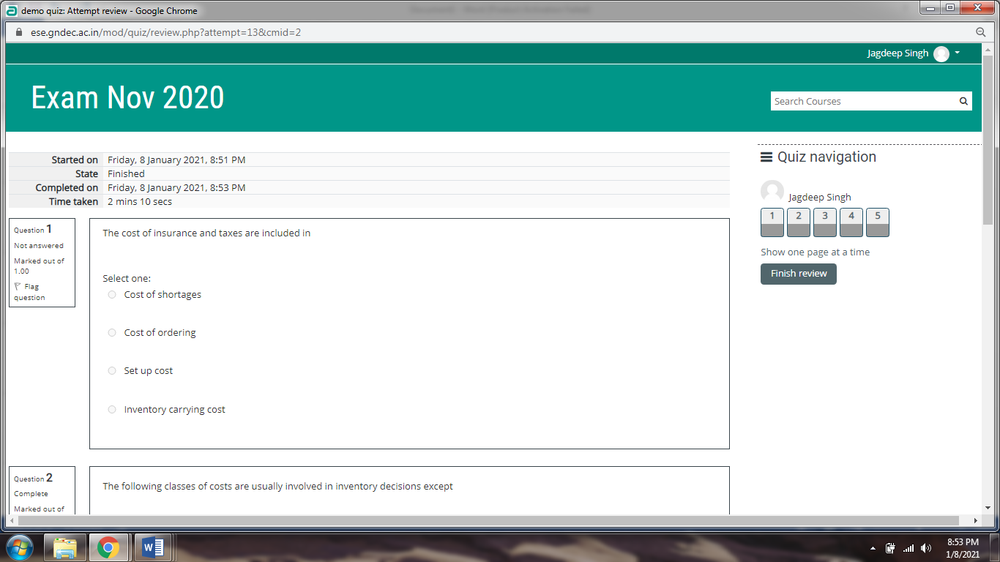

1. Now your exam is submitted successfully.
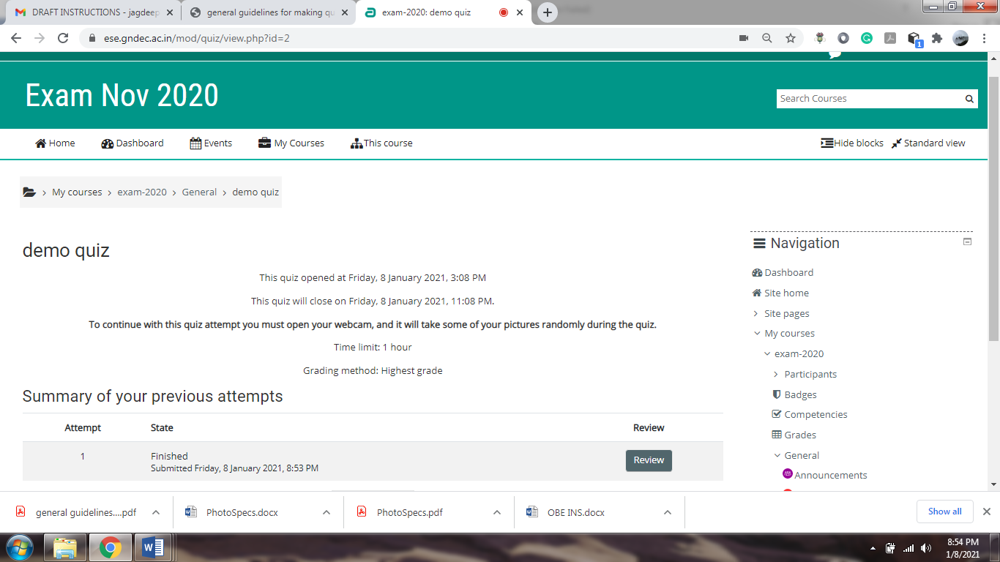
