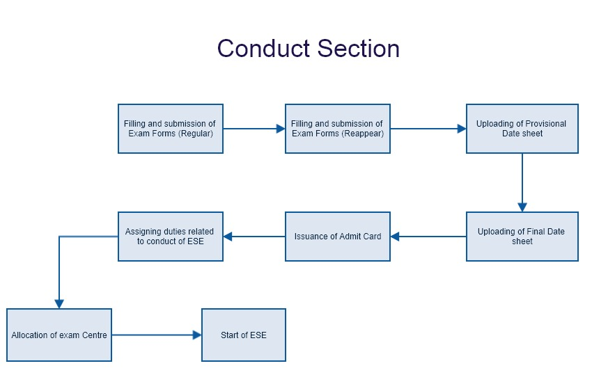
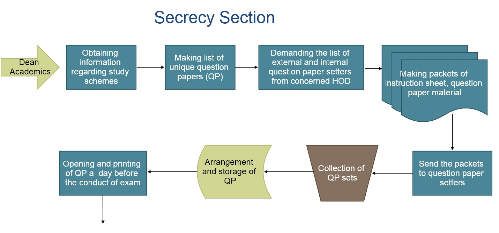
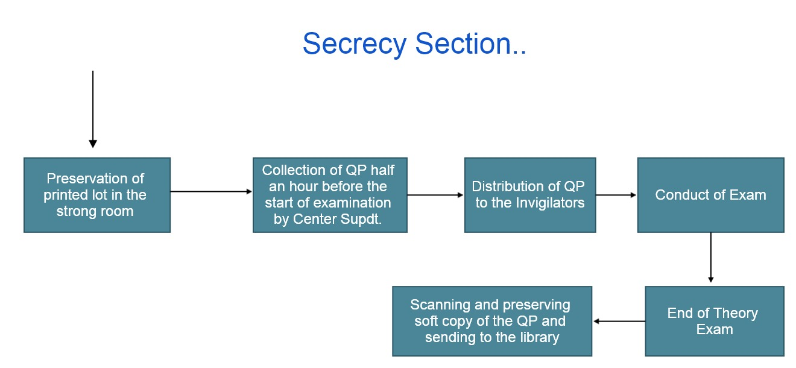
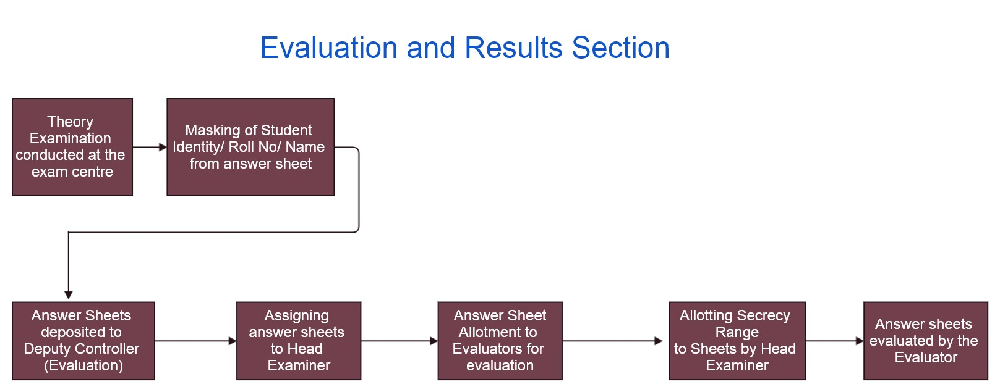
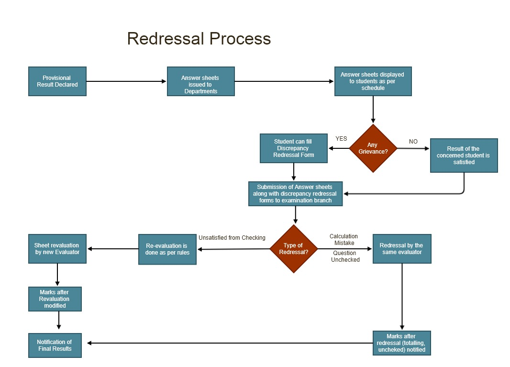

# Guru Nanak Dev Engineering College, Ludhiana

## Examination Manual

  --------------------------------------------------------------------------------------------------------------
  S. No.    Particulars                                                                   Pages/
                                                                                                  
                                                                                                  Annexure
  ------------- --------------------------------------------------------------------------------- --------------
  1         Manual of Examination Branch                                                  

  2         Guidelines/Instructions for Appointment of Internal/ External Paper Setters   

  3         Guidelines/Instructions to the Question Paper Setter                          

  4         Guidelines/Instructions to the Invigilators                                   

  5         Guidelines/Instructions for Examiners                                         

                Guidelines/Instructions for Flying Squad                                      

                Instructions for Candidates                                                   

                Guidelines to be followed for Decoding & Verification                         

  6         Remuneration related to Examinations                                          

  7         Examination Fee Details                                                       

  8         Guidelines for imposing punishment for UMC/Misconduct cases                   

  9         Officers / Staff at Controller of Examinations (COE)                          

  10        Working of Conduct Section                                                    

  11        Working of Secrecy Section                                                    

  12        Working of Evaluation Section                                                 

  13        Discrepancy Redressal Process                                                 

  14        Various Proformas used in Examination Branch                                  

  15        Guidelines for Special Chance Exam                                            

  16        Guidelines for Make Up Exam                                                   

  17        Guidelines for Improvement Exam                                               

  18        Guidelines for Aptitude test                                                  
  --------------------------------------------------------------------------------------------------------------

Abbreviations 

BOE- Board of Examination

BOS- Board of Studies

COE-Controller of Examination

HOD- Head of the Department

ESE-End Semester Examination

UMC- Unfair Means Cases

DRC- Discrepancy Redressal Issue

CRC- Complaint Redressal Committee

MPD- Mentoring and Professional Development

{width="3.472222222222222e-3in"
height="1.5277777777777777e-2in"}{width="1.388888888888889e-3in"
height="1.5277777777777777e-2in"}{width="3.472222222222222e-3in"
height="1.5277777777777777e-2in"}{width="1.388888888888889e-3in"
height="1.5277777777777777e-2in"}{width="3.472222222222222e-3in"
height="1.6666666666666666e-2in"}{width="1.388888888888889e-3in"
height="1.6666666666666666e-2in"}{width="3.472222222222222e-3in"
height="1.6666666666666666e-2in"}{width="1.388888888888889e-3in"
height="1.6666666666666666e-2in"}{width="1.388888888888889e-3in"
height="1.6666666666666666e-2in"}{width="3.472222222222222e-3in"
height="1.6666666666666666e-2in"}{width="1.388888888888889e-3in"
height="1.6666666666666666e-2in"}{width="1.388888888888889e-3in"
height="1.6666666666666666e-2in"}

Formation of BOE (Board of Examinations)

> A committee consisting of following members will act as a board of
> examination (BOE).

a.  Dean (Academic) – Convener

b.  Controller of Examinations—Member

c.  Heads of various Departments- Member

1 The Powers and Duties of BOE:

> 1.1.1 The BOE shall ensure proper performance of the various duties in
> conducting examinations viz. paper setting, date sheet preparation,
> evaluation and declaration of results.
>
> 1.1.2 The BOE shall recommend examination reforms and shall implement
> them after approval of academic council.
>
> 1.1.3 The BOE shall arrange for strict vigilance during the conduct of
> examination so as to avoid use of unfair means by the students,
> faculty, and invigilators.
>
> 1.1.4 BOE shall constitute a Complaint Redressal Committee (CRC),
> which shall be an independent committee consisting of three members
> appointed by Chairman, BOE as and when required to deal with the
> complaints related to the conduct of examinations.
>
> 1.1.5 The recommendations of the CRC shall be approved by Chairman,
> BOE to take appropriate disciplinary actions in the concerned matter.
> The disciplinary actions shall be endorsed by the BOE.
>
> 1.1.6 For any meeting of BOE, one-third members shall constitute a
> quorum. However, the same meeting shall be held after 30 minutes of
> the scheduled time, for which, no quorum shall be applicable
>
> 1.1.7 The members of BOE shall meet at least twice during the academic
> year and at other times as and when necessary.

1.  The BOE shall also act as an advisory body to the COE for smooth
    conduct of examination

2.  COE shall be assisted by the coordinators for carrying out the
    following activities during end semester examinations (ESE).

<!-- -->

a.  Paper Setting : Deputy Controller (Question Paper Setting and
    > Printing) and Head of concerned Department

b.  Examinations (Theory): Superintendent, Dy Superintendent and
    > invigilators.

c.  Examinations (Practical, Project/Dissertation, seminar): Head of
    > concerned department.

d.  Evaluation of answer books: Deputy Controller (Evaluation) & Head
    > Examiners

e.  Preparation and declaration of final results: Deputy Controller
    > (Decoding & Results)

f.  Showing of answer books to the students after evaluation: Head of
    > concerned department.

> Appointment of Paper Setters and Examiners
>
> 2.1 Chairman of concerned BOS shall recommend a panel of examiners
> both internal and external.
>
> 2.2 Minimum 30% papers will be set by the external examiners.
>
> 2.3 Minimum teaching experience of any examiner (internal/external)
> should be three years but in case of any urgency Chairman BOE can
> relax this condition.
>
> 2.3 In case of deviations, the concerned Head of the department shall
> do alternative arrangement and inform COE.
>
> 2.4 The paper setter should not be a part time PG student of GNDEC.
>
> 2.5 The concerned examiners shall follow all paper setting related
> guidelines from COE

Question Paper Setting 

> 3.1 The appointed examiner will set the paper and submit two copies of
> the same to the COE.
>
> 3.2 The official deputed by the COE shall take care of photocopying
> the required number of copies (with 10 extra copies). The photocopying
> shall be done one day before the commencement of that particular
> examination.
>
> 3.3 The concerned staff shall maintain secrecy of the question paper
> and shall be responsible for the same.
>
> 3.4 The COE office shall make the copies of papers in required
> quantity, put them in a packet, seal the packet, put his/her signature
> on the seal, write details (such as course, course code etc) on the
> packet and handover this sealed packet to the superintendent
> examination at least one hour before the scheduled time of examination
> of that course.
>
> 3.5 For ESE, the faculty who has set the question paper should submit
> the solution in a separate sealed envelope.
>
> 3.6 A committee shall be constituted for the purpose of quality checks
> on question paper setting and evaluation, appointed by Chairman BOE
> and the committee shall report the anomalies, if any to Chairman, BOE.

Conduct of Examination

4.1 General

> 4.1.1 The various examinations for U.G. / P.G. Programmes shall be
> conducted in accordance with the Academic Rules and Regulations for
> U.G. and P.G. courses respectively and also as per the Examination
> Schemes approved by BOS for the various Programmes.
>
> 4.1.2 The odd semester and even semester examinations will be
> conducted separately and there shall be no overlapping between the
> date sheet of odd and even semester.
>
> 4.1.3 Seating arrangement shall be made by the superintendent
> examination taking into considerations the total number of students
> appearing for the examination.
>
> 4.3.4 The appointment of the required number of invigilators shall be
> done by examination cell centrally as per the examination schedule.
> These invigilators shall be from among the faculty or competent
> support staff recommended by respective department/COE. It is
> mandatory on the faculty to be available for invigilation during the
> examination. On the day of examination, the superintendent shall bring
> the sealed packets of question papers, open them at least 20 minutes
> before the examination and distribute it to the invigilators at least
> 10 minutes before the beginning of the examination.
>
> 4.3.5 Invigilators shall distribute the answer books to the students
> at least 10 minutes before the start of the examination. He/she shall
> check the identity cards of the students, check whether the students
> have occupied their right seats as per the seating arrangement, check
> whether students have correctly filled the details on front page of
> answer books and then shall sign on the answer books of the students.
> He shall then obtain the signature of the students on the attendance
> proforma and maintain the attendance record of the students of his/her
> room.
>
> 4.3.6 Invigilator shall check the general discipline during the
> conduct of examination and report the cases of indiscipline,
> misbehavior and copying to the examination coordinator for further
> necessary action.
>
> 4.3.7 At the end of the examination, invigilator shall conceal the
> roll number of the examinee and collect the answer books from the
> students and will submit the packet to the Superintendant
> Examinations.
>
> 4.3.8 Exam superintendent shall maintain the record of answer books
> and other stationary used for the examination.
>
> 4.3.9 Flying squad team, shall be constituted by the BOE to maintain
> the smooth conduct of examination. The flying squad team may be
> Internal / External.

4.2 End Semester Examination (ESE)

> 4.2.1 At the end of each semester, there shall be a written ESE for
> every theory course.
>
> 4.2.2 The ESE for theory courses shall be conducted centrally.
>
> 4.2.3 The marks and of duration of each examination paper shall be as
> mentioned in the examination scheme approved by BOS of the respective
> programme.
>
> 4.2.4 The examination shall be based on entire syllabus of the
> respective course.
>
> 4.2.5 Number of questions shall be as per the as per the guidelines
> given by the COE.
>
> 4.2.6 ESE for lab courses and project shall be conducted as per the
> examination scheme.
>
> 4.2.7 ESE for theory courses of all programs shall commence as per the
> schedule approved by the BOE. However in case of any emergency, the
> Chairman, BOE is empowered to reschedule any examination.
>
> 4.2.8 COE shall be responsible for smooth and proper conduct of
> examination in the Institute with the help of Dean (Academics) and
> superintendant Examinations.

He / She shall -

> i Give the directions to all superintendents for smooth conduct of
> examination.
>
> ii Depute invigilation related staff in all the examination centers
> based on total strength of students appearing in the examination.
>
> iii Get the examination schedule prepared for the entire programme and
> send the copy of the same to Dean (Academics) and HOD’s.
>
> iv Receive the cases of misbehavior, malpractices, copy cases from HOD
> (for lab course ESE) / Superintendant Examination (For Theory) and
> forward the same to CRC for further necessary action.
>
> v Receive the list of external examiners (for conducting practical
> examinations) for various courses from HOD for record purpose.
>
> 4.2.9 COE shall appoint staff for examination as per following
> structure and forward the copy of the same to Superintendent
> Examinations.
>
> i Superintendent examination: One for each center
>
> ii Deputy Superintendant : One for each centre
>
> iii Invigilator: One invigilator for a group of 30 students or less
>
> iv Invigilator (Outside Duty): One (subject to condition that student
> strength in a centre is more than 300)
>
> v Examination Attendant: Two
>
> vi Waterman: One waterman per 100 students or less.
>
> vii Security man: one per centre
>
> vii Sweeper: Two per centre per session (one male and one female)
>
> 4.2.10 On each day of examination, Superintendent Examination shall
> open the required number of packets of question papers at least 30
> minutes before the start of examination. Prior to opening, however,
> he/she shall sign on all the packets indicating the date and time of
> opening the packets. He / She shall then take out the required number
> of question papers from the packets and arrange to distribute them in
> required quantity to the invigilators.
>
> 4.2.11 Superintendent Examination shall hand over the required
> material to the invigilators, at least 20 minutes before the start of
> the examination.
>
> 4.2.12 Superintendent Examination shall take rounds in different
> examination rooms to confirm that invigilators are performing their
> duties properly and discipline is being maintained during examination.
>
> 4.2.13 Superintendent Examination shall forward the cases of
> misbehavior, indiscipline, malpractices, attempt to copy, copying
> cases to CRC through COE.
>
> 4.2.14 If any examinee is not in a position to write at all, or write
> as fluently as normal student, on account of physical disability or
> injury due to accident just before the examination and produces a
> medical certificate from the Civil Surgeon to that effect, then a
> writer shall be allowed to such examinee. Such a writer shall neither
> be a student or a degree holder of any technical programme (Diploma,
> B.E. /B. Tech., M.E./M. Tech., Ph. D. etc.) of this institute or any
> other Technical Institute. The examinee shall, however, apply to COE
> asking for permission to allow for such a writer. COE shall then
> verify the medical certificate and give a permission letter to the
> examinee for using the writer. COE shall then take the undertaking
> from the writer in a prescribed performa. Such examinee shall produce
> the permission letter from COE for using writer to the invigilator.
>
> 4.2.15 In case of physically disabled examinee, who can write but at
> much slower speed as compared to normal student, he/she may be allowed
> an extra time of 15 minutes for writing the examination for all the
> courses, provided he/she seeks permission from Superintendent
> examination for extra writing time on account of his/her disability by
> producing medical certificate from Civil Surgeon to this effect.
>
> 4.2.16 After receiving the answers books from invigilators,
> Superintendent Examination shall check them as per the attendance
> record submitted by the invigilators and then sort out the answer
> books of each course separately.
>
> 4.2.17 Superintendent Examination shall direct the sealing assistant
> to tie the bundles of answer books of each course separately along
> with two copies of question paper, copy of attendance sheet, and pack
> them. Thereafter Superintendent examination shall handover all packets
> to the COE the same day. Superintendent Examination shall maintain the
> record of all such packets of answer books handed over to COE.
>
> 4.2.18 Office-clerk (examination) shall maintain the account of
> answers books consumed for the examination in a register. He /She
> shall also prepare the bills of remuneration of all staff involved in
> the examination work and submit those to Superintendent Examination
> for further action.
>
> 4.2.19 Superintendent Examination shall submit the bill for
> remunerations of staff involved in ESE to COE office as per rules.
> Remuneration shall be paid to the staff involved in conduct of
> examination after the examination is over.

4.3 End Semester Examination for Lab courses

> 4.3.1 End Semester Examination for lab shall be conducted as per the
> examination schedule approved by BOE. However in case of any
> emergency, the examination may be rescheduled with the prior approval.
>
> 4.3.2 HOD shall act as coordinator for conducting practical
> examinations and shall be responsible for proper conduct of practical
> examinations and various examination related activities of the
> concerned department. He / She shall, however, take the services of
> staff of his/her Department for this purpose.
>
> 4.3.3 HOD’s shall prepare the schedule for Lab of the concerned
> department as per the time slot given by COE.
>
> 4.3.4 The examiner for the lab course ESE (UG), other than course
> faculty can be a competent faculty from the same or other department
> of GNDEC. However, the head of concerned department can request to COE
> to appoint an examiner outside GNDEC, if he/she desires so.
>
> 4.3.5 For UG project/ six months training and PG Thesis examiner
> outside GNDEC is mandatory.
>
> 4.3.6 HOD shall submit the copy of schedule of lab examinations along
> with the list of appointed Internal and External (Lab wise) to the
> COE.
>
> 4.3.7 HOD of the Department shall appoint staff for lab examination as
> per following structure and forward the copy of the same to the COE.
>
> I Laboratory Attendant: One for each course, preferably of the
> respective laboratory.
>
> The structure of staff for practical examination in Workshop Practice
> shall be as under;
>
> Internal Examiner: One for each workshop, preferably the course
> faculty.
>
> Foreman: One for each workshop appointed by Central Workshop
> superintendent.
>
> Shop Instructor: One for each workshop, in which the examination is to
> be conducted appointed by Central Workshop superintendent.
>
> Attendant: One for each workshop, in which examination is to be
> conducted appointed by Central Workshop superintendent.
>
> 4.3.8 In case of common courses in the same semester of different
> programmes, different internal examiners and external examiners may be
> appointed for each programme. In case external examiner doesn’t report
> for the examination due to emergency, the concerned HOD shall make
> alternative arrangement.
>
> 4.3.9 Internal examiners along with laboratory attendants shall make
> all the necessary arrangements of equipment / laboratory setup
> required for conducting lab examination of the courses for which their
> appointment is made.
>
> 4.3.10 Lab examination shall be conducted in any one of the following
> manners:
>
> i\. Oral Examination (viva voce) only: Both internal and external
> examiners shall assess his/her knowledge of the course.
>
> ii Practical and oral Examination: The students are required to
> perform the given experiment/do the given job in the workshop/prepare
> a drawing / develop a computer program. The performance of the
> students shall be assessed jointly by both the examiners.
>
> 4.3.11 After the lab examination of the course is over, internal
> examiner along with the other examiner shall prepare the mark list,
> and submit it in sealed envelope to exam cell on the same day, or
> latest by the next working day along with TA/DA and remuneration
> bills. The internal examiner may keep a copy of the mark list in his
> custody safely for future verification. These marks are not to be
> disclosed to the students.
>
> 4.3.12 Any discrepancy in the record submitted for lab examination
> shall be corrected only after recommendation and written permission
> from HOD.
>
> 4.3.13 HOD /Professors will be deputed as Centre Superintendant.

Central Evaluation

5.1 General

> 5.1.1 It shall be mandatory for every faculty of GNDEC, Ludhiana to
> evaluate the answer books of his/her course or answer books of other
> courses as instructed by the HOD/ Head Examiner within stipulated
> time.
>
> 5.1.2 All the evaluation of a course shall be done by the concerned
> faculty.
>
> 5.1.3 Evaluation of ESE (theory) shall be done centrally.
>
> 5.1.4 In case of any discrepancies in the question paper that may
> affect the assessment, a committee consisting of Dean (Academics),
> respective HOD and Subject Expert shall decide the course of action
> and shall give the guidelines for evaluation.
>
> 5.1.5 Head Examiners (HOD / Senior faculty) will be appointed from
> each department who will be responsible for smooth evaluation of
> answer booklets of his/ her respective department.

5.2 Evaluation Procedure

> 5.2.1 Coordinator (Evaluation) shall issue answer books to the
> concerned faculty through respective Head Examiners.
>
> 5.2.2 The concerned faculty shall assess and submit the assessed
> answer books to the coordinator.
>
> 5.2.3 The examiners shall follow the instruction given by the COE.
>
> 5.2.4 The evaluated answer books shall be scrutinized further.
> “Scrutiny” shall include checking for un-assessed answers, totaling of
> marks, and transfer of marks to main page, blank pages scratched etc.
> In case of any corrections, it shall be brought to the notice of
> concerned faculty. The faculty shall do required correction before
> submitting the final marks
>
> 5.2.5 In case of any discrepancies observed or reported in evaluation,
> COE is authorized to get the answer books evaluated from any other
> competent internal or external evaluator and update the results
> accordingly. The COE shall report the same to BOE for necessary
> further action, if any.

5.3 Procedure to show Theory ESE answer booklets to students:

> 5.3.1 After the ESE theory assessment and marks entry in prescribed
> format, the faculty shall submit the ESE mark list. For showing the
> answer books to students, the exam cell shall issue the answer books
> to the concerned HOD after signing an undertaking.
>
> 5.3.2 The concerned HOD shall prepare a time table for showing the
> answer books to the concerned students. The time table shall be
> displayed on the department notice board and the same shall be
> submitted to exam cell.
>
> 5.3.3 The faculty shall show the answer books to the students as per
> the schedule declared by the HOD.
>
> 5.3.4 The course faculty shall review the answer books based on the
> queries from students. He / She shall keep record of students‟
> attendance in this process.
>
> 5.3.5 The HOD shall constitute respective DRC for addressing any
> discrepancy (Marks totaling, Unevaluated questions, reevaluation)
> pointed out by the student. The student shall need to pay requisite
> fee for the reevaluation only.

5.4 Preservation of Answer Books:

> All assessed answer books shall be preserved for Six months in
> examination cell from the date of Result Notification.

Tabulation and Declaration of Results

> 6.1 i. Evaluators are provided with security code range which they
> allot to each Answer booklets randomly and then enter the marks
> through software against allotted security codes
>
> ii\. Decoding team members open the Answer booklet and enter the security
> codes against University Roll Numbers through software. The marks are
> automatically displayed against security code.
>
> iii\. Verification team members verify the University Roll Numbers,
> Security code & corresponding marks for any discrepancy.
>
> iv\. Provisional result is declared & displayed

6.2 Amendment of Results due to errors

> In case it is found that the result of an examination has been
> affected by errors, the COE shall amend such a result in such a manner
> as shall be in accordance with the true position and to make such
> declaration as is necessary. A report listing such amendments shall be
> submitted by the COE to BOE. The error means

i)  error in computer/data entry, printing or programming;

ii) clerical error, manual or machine error, in totaling or entering of
    marks on ledger / register;

iii) error due to negligence or oversight of examiner or any other
    person connected with evaluation, moderation and result tabulation.

List of the Formats / Guidelines used In Examination Cell

  S.No.   Contents
  ----------- --------------------------------------------------------------------------------------------------------------------
  1           Appointment of Paper Setter of Theory Question Paper for End Semester Examinations (Month & Year) of Our Institute
  2           Acceptance form (For External Paper Setter)
              
  3           Guidelines for theory question paper setter (B.Tech. 1^st^ / 2^nd^ semester)
              
  4           Guidelines for theory question paper setter
              For the subject Human Values and Professional Ethics (HVPE)
              (B.Tech./M.B.A. 1^st^ / 2^nd^ semester)
  5           Guidelines for theory question paper setter (B.Tech. 3^rd^/4^th^/5^th^/6^th^/7^th^/8^th^ semester)
              
  6           Guidelines for theory question paper setter (M.Tech.)
              
  7           Guidelines for theory question paper setter (M.Tech. (VLSI))
              
  8           Guidelines for theory question paper setter MBA- 2012 Batch Onwards
  9           Guidelines for theory question paper setter MBA –Up-to 2011 Batch
  10          Guidelines for theory question paper setter (MCA)- Batch 2012 Onwards
  11          Guidelines for theory question paper setter (MCA) – Batch up-to 2011
  12          Remuneration bill-cum-receipt
  13          Formats for Question Papers

Guidelines/Instructions for Appointment of Internal/ External Paper
Setters

> 1\. Appointment of examiners for both theory and/or lab examinations
> shall be made 20 days before the commencement of ESE.
>
> 2\. The acceptance of appointment by an external paper setter/examiner is
> expected within eight days from the dispatch of the appointment order.
> However, if no written or verbal communication is received from the
> paper setter/examiner within the prescribed time period, then his/her
> appointment is treated as cancelled and a new appointment order shall be
> issued to another paper setter/examiner from the panel submitted by
> respective HOD. It is mandatory for the faculty members of GNDEC,
> Ludhiana to accept the offer of examiner ship. Keeping in view the time
> constraint, COE can decide to set the theory Question papers by sending
> some faculty to concerned examiner. Prior approval for the same will be
> taken from the Chairman of BOE.
>
> 3\. If the paper setter/examiner other than course faculty is appointed,
> he/she should not disclose his/her appointment. He / She shall make
> correspondence regarding any matter connected with the examination in
> sealed envelope only.
>
> 4\. The paper setter/examiner should follow all the directions given by
> the COE from time to time regarding of pattern of question papers,
> setting of question papers, submission of model answers, scheme of
> marking, etc.

Guidelines/Instructions to the Question Paper Setter

> 1\. The question paper format with common instructions printed on it
> shall be provided to the paper setter.
>
> 2\. The maximum marks and time allowed shall be as per the syllabus
> already approved by BOS.
>
> 3\. The nature of question paper should be precise. Paper setter should
> design question paper such that the questions:
>
> i\. are unambiguous
>
> ii\. are written in simple, and meaningful words.
>
> iii\. are asked for appropriate marks
>
> iv\. cover the entire syllabus prescribed for the course.
>
> 4\. Question should be set in such a way that it shall test the skill of
> applying the knowledge acquired, rather than testing the memory.
> Questions shall not be based on merely book information. The questions
> should check the student’s analytical ability and should contain minimum
> 40% analytical questions, if applicable.
>
> 5\. Question paper should be set as per the format provided to the
> examiner.

Guidelines/Instructions to the Invigilators

1.  The invigilators shall enter the examination hall at least 15
    minutes before the start of examination. He / She shall,

2.  Ask the students to keep their books, note books, mobile phones and
    their written materials at the front of the hall/outside the hall.

3.  Check whether the students have occupied their seats as per the
    seating arrangement.

4.  Distribute answer books to the students at least 10 minutes before
    the start of the examination and ask them to fill in correct details
    on the front page of the answer books,

5.  Distribute the question papers to the students at the beginning of
    the examination,

6.  Check the identity cards of the students and sign on their answer
    books, if all details are correct,

7.  Take the signature of students on the attendance performa, mark
    “ABSENT‟ for absent students and maintain the attendance record of
    his/her examination hall,

8.  Distribute the graph papers, log table etc. to the students as and
    when demanded by the students.

9.  Maintain general discipline in the Examination hall by frequently
    moving in the examination hall and preventing any malpractices or
    attempt of copying by students.

10. Report cases of misbehavior, indiscipline, malpractices and copying
    cases of students to the Centre Superintendant for further necessary
    action,

11. Collect the answer books from the students after concealing his/ her
    identity at the end of examination, for each course separately.

12. The Invigilator must ensure that all the three stamps (COE stamp,
    Date Stamp and Space below cancelled) have been put at the proper
    places on the answer booklets.

13. Hand over the answer books to Centre Superintendant

Guidelines/Instructions for Examiners

After receiving the order for evaluation of answer booklets, the
examiner shall

> 1\. Report at the Evaluation Cell.
>
> 2\. Submit the “Examiner’s Declaration” Form given by Evaluation centre
>
> 3\. Collect bundle of answer books from the Coordinator (Evaluation);
> count all the answer books in the bundle. If any difference in number of
> answer books is found, the evaluator shall get it clarified immediately
> from the Coordinator (Evaluation).
>
> 4\. Collect question paper and solution/scheme of marking of the course
> from the Coordinator (Evaluation). If a copy of solutions/scheme of
> marking is not available, he/she shall prepare solutions/model answers.
>
> 5\. Award step-wise marks for each answer.
>
> 6\. Transfer marks carefully on the front page of the answer book and
> carry out total of marks correctly.
>
> 7\. Write marks in double digits (e.g. 01, 02, 12 etc) in the space
> provided on the front page of the answer book. Write 00 marks for the
> question to which answer/s written by the examinee is/are completely
> wrong. Write - (single dash) for the question which is not attempted
> (completely ignored) by the examinee.
>
> 8 Put signature with his/her name in the space provided on the front
> page of the answer book.
>
> 9\. Hand over the bundle and report immediately to the Coordinator
> (Evaluation) for further action if he/she comes across any of the
> following cases while evaluating the answer books.
>
> a\. Answer book found with a written request stating cancellation of
> previously written answer.
>
> b\. Answer book found with multiple-writings, or with multiple use of
> inks or use of ink other than blue colour.
>
> c\. Answer book found attached with any currency note and/or found
> requesting examiner to assess answer book favorably.
>
> d\. Answer book found disclosing identity of the examinee in any form
> with an intent to get clear-cut illegal benefit.
>
> e\. Answer book found with abusive and threatening language of writing.
>
> f\. Question paper with missing data, misprint of any nature.
>
> g\. Evidence of mass copying.
>
> h\. Any other case, in which examiner feels that, the examinee has shown
> intent of seeking favoritism.
>
> 10\. Submit evaluated answer books to office the Coordinator (Evaluation)
> along with mark sheet in prescribed format.

Instructions/Guidelines for Flying Squad

1.  The flying squad team should satisfy themselves regarding
    arrangement made for frisking of candidates at entry gate. Flying
    squad team should report to COE about any kind of mismanagement or
    non-arrangement in frisking.

2.  Id cards have been made compulsory in these exams. Any cases of
    impersonation should be reported to the COE.

3.  It should also be ensured that admit cards are being carried by the
    students.

4.  Seating plan should be checked.

5.  Flying squad should make extra checks on parking and surrounding
    areas of examination centre.

6.  They must ensure that no person other than those deployed for duty
    is present in examination centre.

7.  The flying squad members should mark their attendance in the
    Register of examination Centre they raided.

8.  They must ensure that no Books, Calculators, Mobile Phones or any
    other material is being carried by candidates into the examination
    hall/room.

9.  The members of the squad will also have the authority to inspect and
    search any person/candidate in the event of suspicion.

10. The Chairman of flying squad team must submit report regarding visit
    to the examination Centres to COE on the same day on which Centre is
    visited on the requisite Proforma (sealed and marked confidential).

11. They must ensure that use of Mobile Phone or any other electronic
    gadget by the Candidate(s) as well as the staff on duty in the
    Centre premises is strictly prohibited.

12. The Chairman of flying squad shall prepare a detailed report of all
    examination Centres separately and shall handover to COE at the end
    of exam (sealed and marked confidential).

Instructions for Candidate

-   Candidates can view status of their examination regular/reappear
    form (received or not received) and their date sheet (as applicable)
    in their student login (academics.gndec.ac.in) for end semester
    examinations.

-   Candidates can view their examination center details on institute
    website (gndec.ac.in) as well as their respective student logins
    (academics.gndec.ac.in).

-   No admit card for end semester examination will be issued after
    stipulated date.

-   Candidates must carry admit card duly signed by respective HODs
    (ensure it has also been stamped).

-   Candidates are required to carry their College ID Cards in the
    examination centers.

-   Candidates must be seated in the examination centre at least 20
    minutes before the start of the examination and in any case they are
    not allowed to enter 30 minutes after the start of examination.

-   Answer should be attempted section wise.

-   Candidate must mark their attendance in the relevant column on the
    attendance sheet.

-   Candidate must all the fields on the first page of answer sheet
    where it is mentioned 'For Candidate Only' The sample data is
    provided here:

  Examination Month and Year:   May - 2019
  --------------------------------- ----------------------------------------------------- --------------------------------- --------------------------------
  Program / Course:             B.Tech./M.Tech./MBA/MCA (as applicable)
  Branch:                       Information Technology (do not write abbreviation)
  Subject Name:                 Engineering Mathematics (do not write abbreviation)
  Subject Code:                 BTAM-101 (as per your admit card)
  Regular/Reapper:              Regular (as applicable)
  Session (Morning/Evening):    Morning (as applicable)
  Name:                         Raman Singh
  Univ. Roll No. (in words):    ONE FOUR THREE TWO FIVE

-   Candidate must check physically the answer booklet before writing
    anything on it. Number of pages in the answer booklet are 32. No
    supplementary answer booklet / continuation sheet will be provided.

-   Candidate should strictly follow the instructions / note in the
    question paper.

-   Any missing data on question paper may be assumed appropriately.

-   Write answers on both sides of the answer booklet except on the back
    and front side of the title page. Don’t leave any blank page/s in
    between the answers.

-   Candidate must write appropriate Question No. on the left hand
    margin of the page.

-   Candidate should not possess any objectionable written / printed
    material.

-   Candidate should not put his/her Roll No. / Name / Phone No. /
    Identification mark / Appeal etc. at any place inside the answer
    booklet.

-   Candidate should not carry mobile phone (s) / any other
    objectionable gadgets (even in switched off condition) in the
    examination centre.

-   Candidate will be considered for Unfair Means Cases (UMC) if he/she
    indulges in any unfair activity mentioned hereby and UMC regulations
    of College.

-   Candidate will be held responsible if the 'space below cancelled
    stamp' is missing / double stamping or stamp is not at the exact
    place i.e. at the end of the written matter on the answer sheet.

-   Anything written after 'stamp below cancelled' cannot be claimed for
    evaluation.

-   Candidate is not allowed to leave the room in allotted center before
    half time.

-   Candidate will not be allowed to take the question paper outside
    before 2.30 hours of start of exam.

-   Candidate must cross the blank pages of answer booklet.

-   Use only black/blue pen for writing the exam.

-   Candidates are advised to keep visiting institute website
    (gndec.ac.in) and their student logins (academics.gndec.ac.in)
    regularly for updates.

-   In case of double stamping of “Space Below Cancelled” stamp the
    student must ask the invigilator to cancel out and counter sign the
    extra stamp.

Guidelines to be followed for Decoding & Verification

*Decoding*

1.  Eight teams of two Staff Members each are constituted for decoding
    and verification of results.

2.  Each team would decode and verify 3000 sheets approximately.

3.  During the process the decoding and verification the staff members
    should not decode and verify the answer sheet of the parent
    department and courses that has been taught by them in the current
    semester.

*Results & Verification*

1.  Three teams of two staff members each are constituted for awards
    verification (internal theory, internal practical and external
    practical)

2.  Each team should verify the awards of the branches allocated to
    them.

3.  During the process of awards verification, the staff members should
    not verify the awards of the parent department.

Remuneration related to Examinations

  ---------------------------------------------------------------------------------------------------------------------------------------------------------------------------------------------------------------------------------------------------------------------------------------------------------------------------------------------------------------------
  S. No.   Position                                                                                     Number                        Remuneration (Rs.)
  -------- -------------------------------------------------------------------------------------------- ----------------------------- ---------------------------------------------------------------------------------------------------------------------------------------------------------------------------------------------------------------------------------
  1.       Clerk (Assistant to Controller)                                                              03                            4500/- per End Semester Examination

  1.       Chairman (Flying Squad) (Internal)                                                           03                            5000/- per End Semester Examination

  1.       Member Flying Squad (Internal)                                                               02 to 04                      4000/- per End Semester Examination

  1.       Centre Supdt.                                                                                01 per Centre                 300/- per Conduct session
                                                                                                                                      
                                                                                                                                      500/- for opening and closing

  1.       Deputy Supdt.                                                                                01 per centre                 200/- per conduct session
                                                                                                                                      
                                                                                                                                      300/- for opening and closing

  1.       Invigilator                                                                                  01 to 30 candidates           150/- per conduct session per person

  1.       Clerk / Computer Operator                                                                    01 per Centre                 125/- per conduct session
                                                                                                                                      
                                                                                                                                      250/- for opening and closing

  1.       Daftri                                                                                       01 per Center                 100/- per conduct session
                                                                                                                                      
                                                                                                                                      200/- for opening and closing

  1.       Helper                                                                                       01 per centre                 100/- per conduct session

  1.       Waterman                                                                                     01 per 100 candidates         100/- per conduct session

  1.       Sweeper                                                                                      01 per centre                 100/- per conduct session

  1.       Security                                                                                     01 per centre                 100/- per conduct session

  1.       External/ Internal Examiner for Practical Viva-voce Examination                              -                             10/- per candidate with minimum of Rs.150/- per day (Including Institutional Training / Workshop training / Industrial Training)
                                                                                                                                      
                                                                                                                                      20/- per candidate (for 6 months Industrial Training / Project) with Minimum of Rs.200/- per day)
                                                                                                                                      
                                                                                                                                      Note: Incase reappear in practical examinations-for same subject for which exam is to be conducted then Rs.10/- Rs.20/- is to be paid, however incase if it is conducted for few candidates then minimum rates are applicable .

  1.       Lab staff for Practical and Viva-voce                                                        -                             5/- per candidate

  1.       Helper attached to Controller                                                                01 to 02                      2500/- per End Semester Examination

  1.       Head Examiner                                                                                10 (One for each Department   1.5/- per answer booklet

  1.       Paper Setting                                                                                -                             Rs.1000/- per Paper setting

  1.       Evaluator                                                                                    -                             15/- per answer booklet

  1.       Checking Assistant                                                                           05 to 10                      1.5/- per answer booklet

  1.       Clerk (Evaluation)                                                                           04 to 10                      100/- per conduct session per person

  1.       Helper / Attendant (Evaluation)                                                              02                            60/- per conduct session

  1.       Technical Staff (Computer, Electrician. Generator Operator) and their Helper (if any)        03 to 04 Technical Staff      2000/- per End Semester Examination per Technical Staff
                                                                                                                                      
                                                                                                        01 to 02 Helper/Attendant     1200/- per End Semester Examination per Helper

  1.       Security (Evaluation)                                                                        01                            60/- per Conduct Session

  1.       Sweeper (Evaluation)                                                                         01                            60/- per conduct session

  1.       Helper (Verification)                                                                        01 to 02                      2500/- per End Semester Examination per person

  1.       Personnel for decoding of answer booklets and verification of data upto Provisional Result   10 to 20                      1.5/- per answer booklet

  1.       Security (Verification)                                                                      01                            100/- per Conduct session
  ---------------------------------------------------------------------------------------------------------------------------------------------------------------------------------------------------------------------------------------------------------------------------------------------------------------------------------------------------------------------

> Note: The number of person deputed can be increased / decreased with
> the prior permission of Chairman BOE.

Examination Fee Details

> Detail of Examination fee and late fee:
>
> Regular Candidates : Already paid (Included in the semester fee)
>
> Reappear Candidates : Rs.700/- per semester (for 2011 & 2012 Admission
> year)
>
> Rs. 1000/- per semester (for 2013, 2014 & 2015 Admission year)
>
> Rs. 1200/- per semester (for Admission Batch 2016 & Onwards)
>
> Late fee will be charged as per the guideline issued by BOE time to
> time.

Note: The hike in Examination fee is recommended keeping in view the
increased expenditures due to bifurcation of even and odd semester
examinations.

Guidelines for imposing punishment for UMC/Misconduct cases 

Following are the guidelines to be used by Complaint Redressal Committee
(CRC) for imposing punishment on the examinees caught copying/involved
in any type of misconduct during or after Examination:

+-----------------------+-----------------------+-----------------------+
| Sr. No.           | Nature of           | Quantum             |
|                       | Malpractice         | ofPunishment        |
+=======================+=======================+=======================+
| 1                     | Examinee found        | Cancellation of end   |
|                       | communicating or      | semester examination  |
|                       | talking with other    | of that subject       |
|                       | examinees during      |                       |
|                       | examination           |                       |
+-----------------------+-----------------------+-----------------------+
| 2                     | Examinee found with   | Cancellation of end   |
|                       | copying material      | semester examination  |
|                       | related to the paper  | of that subject       |
|                       | but having not used   |                       |
|                       | the material          |                       |
+-----------------------+-----------------------+-----------------------+
| 3                     | Revealing identity in | Cancellation of end   |
|                       | any form in the       | semester examination  |
|                       | answer written or in  | of all external       |
|                       | any other part of the | theory subjects of    |
|                       | answer book by the    | that exam session     |
|                       | examinee with clear   |                       |
|                       | intent of getting     |                       |
|                       | illegal benefits      |                       |
+-----------------------+-----------------------+-----------------------+
| 4                     | Examinee found        | Cancellation of end   |
|                       | marking an appeal to  | semester examination  |
|                       | the examiner          | of all external       |
|                       | revealing both i.e.   | theory subjects of    |
|                       | name and address      | that exam session     |
+-----------------------+-----------------------+-----------------------+
| 5                     | Examinee found        | Cancellation of end   |
|                       | writing provocation,  | semester examination  |
|                       | abusive or            | of all external       |
|                       | threatening language  | theory subjects of    |
|                       | in the answer book    | that exam session     |
+-----------------------+-----------------------+-----------------------+
| 6                     | Examinee found having | Cancellation of end   |
|                       | written on palm or on | semester examination  |
|                       | his/her body or on    | of all external       |
|                       | clothing in the       | theory subjects of    |
|                       | examination           | that exam session     |
+-----------------------+-----------------------+-----------------------+
| 7                     | Cases of mass         | Cancellation of end   |
|                       | copying/individual    | semester examination  |
|                       | copying reported in   | of all external       |
|                       | assessment center     | theory subjects of    |
|                       | reported during the   | that exam session     |
|                       | examination           |                       |
+-----------------------+-----------------------+-----------------------+
| 8                     | Examinee caught       | Cancellation of end   |
|                       | copying from the      | semester examination  |
|                       | copying material,     | of all the external   |
|                       | whether examinee      | theory subjects of    |
|                       | accepts or denies of  | that exam session and |
|                       | the same              | debarring in the      |
|                       |                       | external theory of    |
|                       |                       | the same subject for  |
|                       |                       | next exam session     |
+-----------------------+-----------------------+-----------------------+
| 9                     | Examinee found        | Cancellation of end   |
|                       | exchanging answer     | semester examination  |
|                       | books/slip of papers  | of all the external   |
|                       | without her           | theory subjects of    |
|                       | examinees/ writing    | that exam session and |
|                       | from others answer    | debarring in the      |
|                       | book/allowing other   | external theory of    |
|                       | examinee to copy from | the same subject for  |
|                       | his/her answer book.  | next exam session     |
+-----------------------+-----------------------+-----------------------+
| 10                    | Examinee found        | Cancellation of end   |
|                       | influencing the       | semester examination  |
|                       | examiner/ any other   | of all external       |
|                       | person connected with | theory subjects of    |
|                       | the examination       | that exam session and |
|                       |                       | can appear in only    |
|                       |                       | regular subjects for  |
|                       |                       | next exam session,    |
|                       |                       | debarring from        |
|                       |                       | appearing in any      |
|                       |                       | external theory       |
|                       |                       | reappear exams        |
+-----------------------+-----------------------+-----------------------+
| 11                    | Examinee possessing   | Cancellation of end   |
|                       | copying material and  | semester examination  |
|                       | having copied from    | of all external       |
|                       | the same, but denial  | theory subjects of    |
|                       | of its use, refusal   | that exam session and |
|                       | to give statement to  | can appear in only    |
|                       | that effect.          | regular subjects for  |
|                       | Misbehavior with      | next exam session,    |
|                       | invigilator and       | debarring from        |
|                       | officers related to   | appearing in any      |
|                       | examination           | external theory       |
|                       |                       | reappear exams        |
+-----------------------+-----------------------+-----------------------+
| 12                    | Examinee found        | Cancellation of end   |
|                       | smuggling in or       | semester examination  |
|                       | smuggling out answer  | of all external       |
|                       | book as copying       | theory subjects of    |
|                       | material              | that exam session and |
|                       |                       | can appear in only    |
|                       |                       | regular subjects for  |
|                       |                       | next exam session,    |
|                       |                       | debarring from        |
|                       |                       | appearing in any      |
|                       |                       | external theory       |
|                       |                       | reappear exams        |
+-----------------------+-----------------------+-----------------------+
| 13                    | Examinee found        | Cancellation of end   |
|                       | destroying his own    | semester examination  |
|                       | answer book/ taking   | of all external       |
|                       | away his own answer   | theory subjects of    |
|                       | book and/or removing  | that exam session and |
|                       | blank/ written pages  | can appear in only    |
|                       | from the main answer  | regular subjects for  |
|                       | book                  | next exam session,    |
|                       |                       | debarring from        |
|                       |                       | appearing in any      |
|                       |                       | external theory       |
|                       |                       | reappear exams        |
+-----------------------+-----------------------+-----------------------+
| 14                    | Examinee possessing   | Cancellation of end   |
|                       | copying material and  | semester examination  |
|                       | attempts to destroy   | of all external       |
|                       | the evidence/runs     | theory subjects of    |
|                       | away with copying     | that exam session and |
|                       | material. Misbehavior | debarring from all    |
|                       | with invigilator and  | external theory exams |
|                       | officers related to   | (regular/reappear     |
|                       | exam                  | examination) for next |
|                       |                       | exam session          |
+-----------------------+-----------------------+-----------------------+
| 15                    | Examinee found        | Cancellation of end   |
|                       | smuggling in          | semester examination  |
|                       | previously written    | of all external       |
|                       | answer book and       | theory subjects of    |
|                       | inserting it in       | that exam session and |
|                       | present answer book   | debarring from all    |
|                       |                       | external theory exams |
|                       |                       | (regular/reappear     |
|                       |                       | examination) for next |
|                       |                       | exam session          |
+-----------------------+-----------------------+-----------------------+
| 16                    | Examinee found        | Cancellation of end   |
|                       |                       | semester examination  |
|                       | (i) impersonating     | of all external       |
|                       |                       | theory subjects of    |
|                       | (ii) for whom         | that exam session and |
|                       |     impersonation is  | debarring from all    |
|                       |     noticed           | external theory exams |
|                       |                       | (regular/reappear     |
|                       |                       | examination) for next |
|                       |                       | exam session plus     |
|                       |                       | he/she shall be       |
|                       |                       | handed to police      |
|                       |                       | authorities           |
+-----------------------+-----------------------+-----------------------+
| 17                    | Insertion of currency | Cancellation of end   |
|                       | note to bribe or      | semester examination  |
|                       | attempting to bribe   | of all external       |
|                       | any of the person/s   | theory subjects of    |
|                       | connected with        | that exam session and |
|                       | examination           | debarring from all    |
|                       |                       | external theory exams |
|                       |                       | (regular/reappear     |
|                       |                       | examination) for next |
|                       |                       | exam session and      |
|                       |                       | currency to be        |
|                       |                       | forfeited and deposit |
|                       |                       | in accounts branch of |
|                       |                       | college.              |
+-----------------------+-----------------------+-----------------------+
| 18                    | Examinee found        | Cancellation of end   |
|                       | sending out or taking | semester examination  |
|                       | in question paper     | of all external       |
|                       | from outside          | theory subjects of    |
|                       |                       | that exam session and |
|                       |                       | debarring from all    |
|                       |                       | external theory exams |
|                       |                       | (regular/reappear     |
|                       |                       | examination) for next |
|                       |                       | exam session          |
+-----------------------+-----------------------+-----------------------+
| 19                    | Examinee found        | Cancellation of end   |
|                       | tempering with mark   | semester examination  |
|                       | sheet/certificate     | of all external       |
|                       | issued by the         | theory subjects of    |
|                       | institute             | that exam session and |
|                       |                       | debarring from all    |
|                       |                       | external theory exams |
|                       |                       | (regular/reappear     |
|                       |                       | examination) for next |
|                       |                       | exam session          |
+-----------------------+-----------------------+-----------------------+
| 20                    | Attempt to forge the  | Cancellation of end   |
|                       | signature of the      | semester examination  |
|                       | invigilator on the    | of all external       |
|                       | answer book           | theory subjects of    |
|                       |                       | that exam session and |
|                       |                       | debarring from all    |
|                       |                       | external theory exams |
|                       |                       | (regular/reappear     |
|                       |                       | examination) for next |
|                       |                       | exam session          |
+-----------------------+-----------------------+-----------------------+
| 21                    | Examinee found        | Cancellation of end   |
|                       | bringing or in        | semester examination  |
|                       | possession of any     | of all external       |
|                       | weapon in examination | theory subjects of    |
|                       | room/hall and making  | current exam session  |
|                       | any kind of violence  | and debarring for     |
|                       | among examinees/staff | three additional      |
|                       | of examination        | subsequent exam       |
|                       |                       | sessions in all       |
|                       |                       | external theory       |
|                       |                       | subjects              |
+-----------------------+-----------------------+-----------------------+
| 22                    | Cases of mass copying | Result shall be held  |
|                       | reported during the   | up. Punishment shall  |
|                       | examination           | be based upon the     |
|                       |                       | actual investigation  |
|                       |                       | report.               |
+-----------------------+-----------------------+-----------------------+
| 23                    | If on previous        | Enhanced punishment   |
|                       | occasion a            | can be imposed on the |
|                       | disciplinary action   | examinee. This        |
|                       | was taken against a   | enhanced punishment   |
|                       | examinee for          | may extend to double  |
|                       | malpractice used at   | the punishment        |
|                       | exam and he/she       | provided for the      |
|                       | caught second time    | punishment for the    |
|                       | for malpractice used  | earlier offence of    |
|                       | at examination        | malpractice.          |
+-----------------------+-----------------------+-----------------------+
| 24                    | Examinee involved in  | Case shall be dealt   |
|                       | malpractices at       | with by appropriate   |
|                       | Practical/dissertatio | inquiry committee and |
|                       | n/                    | recommend the         |
|                       | project report        | punishment to         |
|                       | examination           | competent authority   |
+-----------------------+-----------------------+-----------------------+
| 25                    | All other cases not   | Punishment shall be   |
|                       | covered above         | decided by inquiry    |
|                       |                       | committee based on    |
|                       |                       | abovementioned        |
|                       |                       | criteria              |
+-----------------------+-----------------------+-----------------------+
| Note: Complaint   |
| Redressal Committee   |
| may reduce/increase   |
| the punishment        |
| depending on the      |
| severity of the       |
| malpractice.          |
|                       |
| \                   |
|                     |
+-----------------------+-----------------------+-----------------------+

Officers / Staff at Controller of Examinations (COE)

  Designation                                Numbers
  ---------------------------------------------- -------------
  COE                                            1
  Assistant Controller (Conduct)                 1
  Assistant Controller (Evaluation)              1
  Assistant Controller (Decoding Verification)   1
  Assistant Controller (Question Paper Setter)   1
  Assistant Registrar (Examinations)             1
  Computer Programmer                            2
  Clerks                                         4
  Attendant                                      2
  Sweeper                                        1
  Security                                       1

{width="6.617390638670166in"
height="4.610115923009624in"}

{width="6.496455599300088in"
height="3.9391305774278216in"}{width="6.492484689413823in"
height="3.6173906386701664in"}

{width="7.735487751531059in"
height="3.313043525809274in"}

{width="7.796558398950131in"
height="4.119755030621173in"}

{width="7.735687882764655in"
height="7.739130577427821in"}

Guidelines for Improvement Exam

Students of UG and PG of AICTE admitted from 2012 admission (i.e.
admitted under Autonomous Status) under non-credit based scheme will be
given a chance to improve their division i.e. from 2^nd^ division to
1^st^ division after completion of degree subject to the following
conditions:

a)  UG pass out students shall be allowed to appear in 10 theory papers
    (external) out of the total number of theory papers studied during
    the course. Students can appear in theory papers in two exam
    sessions dividing 5 subjects in each examination.

b)  Similarly PG students are allowed to appear in 5 theory papers
    (external) out of the total subjects studied in that course. Student
    can appear in all the five subjects in one exam session.

c)  Examination fee for the above shall be Rs.5000/- per subject.

d)  These papers shall not be conducted separately; students have to
    appear alongwith routine regular/re-appear examination.

e)  In case the student failed to improve the division, the benefit of
    increased marks shall not be considered.

f)  Any student shall be eligible to avail this chance only one time.

g)  This policy will be applicable to only external theory papers only.

This policy will be implemented from May, 2019 examinations onwards.

Guidelines for Makeup Exam

The College is going to conduct Makeup examination for the students who
couldn’t pass their Regular Subjects in last End Semester Examination
(ESE) May-2019. The makeup examination forms will be accepted from
24/07/2019 to 31/07/2019. Instructions for submitting the Examination
Forms are as under-

1.  B.Tech. student can apply for two failed theory subjects of ESE
    May-2019.

2.  Students can download Examination Form and Admit Card from the
    website link https://www.gndec.ac.in/.

3.  Students should submit only one examination form for regular
    subjects of ESE May-2019.

4.  Duly filled Examination form and Admit Card (one recent colored
    photograph pasted on the form and Admit Card) along with examination
    fee Rs. 1000/- (Non-Refundable) per subject must be submitted by
    30/07/2019.

5.  Form and Fee (Cash) should be submitted only in Applied Science
    department.

6.  Correction fee of Rs.700/- is applicable for incorrect forms.

7.  Only failed subjects with internal marks more than & equal to 60%
    can be filled in the form.

8.  The students who remained absent from ESE for valid and convincing
    reasons like Accident or severe illness, with the prior permission
    from the Dean Academics.

In the case of absence from the ESE, it is the responsibility of the
student/ parent/ guardian to inform the college authorities immediately
and need to submit all the relevant evidences (hospital reports, police
reports, certificates from competent authorities, etc.). Prior
intimation and confirmation of permission from office of Dean Academics
is mandatory. Any intimation after the conduct of examination shall not
be entertained.

1.  Exam will be conducted after the eligibility verification by the
    office of concerned department.

2.  The students will be assessed as per absolute grading system. The
    Grade earned by the student in Makeup exam will be awarded the next
    lower passing Grade, that is: grades (‘O’ to ‘C’) will be reduced to
    the next lower grade, while the Grade ‘P’ will remain unchanged.

3.  The student who are either dropped or detained or involved in any
    kind of UMC in the course/s during regular semester will not be
    allowed to appear for the Makeup exam of the specific subject.

4.  The policy regarding Makeup Examination is also attached herewith.

5.  The Makeup examinations are starting from 08-08-2019. The date sheet
    will be notified shortly.

6.  The schedule for Makeup examinations of M.Tech./MBA will be notified
    later.

Note: Incomplete form will not be accepted.

Guidelines for Special Chance exam-

As per the guidelines from IKGPTU,examination branch of Guru Nanak Dev
Engineering College is going to conduct special chance examination for
the students who couldn’t pass their degree within stipulated period.

The following guidelines may be approved to conduct the above stated
examinations:

1)  Students can submit only one examination form (copy attached) for
    all semesters.

2)  Duly filled Examination form (one recent colored photograph pasted
    on the form) along with examination fee Rs. 10,000/-(Non-
    Refundable) per subject.

3)  Fee can be submitted only in the form of DD in favor of Principal,
    GNDEC payable at Ludhiana.

4)  Attested copy of Photo ID proof can be submitted along with
    examination form.

5)  Only failed subjects with complete attendance requirement for the
    study can be filled in the form.

6)  Students, who fill Thesis as subject in special chance examination,
    must ensure to submit their thesis within 5 months form the last
    date of submission of examination form.

7)  Students can fill Thesis as subject in special chance examination
    only if all subjects of the course are cleared successfully.

Instructions for Superintendents/Deputy Supdt. /Invigilators for
Aptitude test-

-   Students must carry College Identity cards during the examination.
    These should be checked by the concerned invigilators.

-   The Superintendents (Supdt.) should ensure that Books, Calculators,
    Mobile phones, Bluetooth devices or any other objectionable material
    are NOT being carried/used by candidates in the examination
    hall/room.

-   It must be verified that through computer on which candidate
    attempting/taking the online test, they cannot access any website
    other than that of test.

-   One A4 size Blank sheet shall be provided to each candidate for
    Rough Work.

-   The Supdt. /Dy. Supdt. /Invigilators must ensure that they have also
    read/announced the instructions (i.e. password for on-line test,
    start time of Exam., use of only blank A4 sheet for rough work) to
    students.

-   The Supdt./Dy.Supdt must ensure that no person other than those
    deployed for duty is present in Examination Centre.

-   The Supdt/Dy.Supdt. should also keep an eye on any malpractice done
    in and around surrounding areas of their Centre.

-   Duty Register should be duly maintained by Centre clerk. The clerk
    must get it signed from every person on duty, specifying the nature
    of duty performed by concerned person on that particular day itself.

-   All invigilators and supporting staff must switch off their Mobile
    phones. Only the Supdt/Dy.Supdt is allowed to use their mobile
    phones.

-   No student should be allowed to go to washroom during first 30
    minutes and last 30 minutes of exam.

-   The Invigilators are required to report at the examination Centre at
    least 15 minutes before the examination time.

-   The Invigilator should ensure seating plan is followed strictly. In
    case of any problem (like computer system malfunctioning, etc.)
    candidate’s seat can be change with prior permission from
    Supdt/Dy.Supdt.

-   The Invigilators must ensure that candidates are seated at allotted
    seat in the examination Centre at least 10 minutes before the start
    of the examination.
