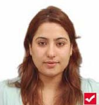
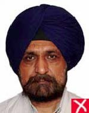
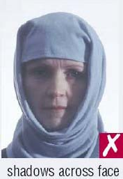

[Back to main 1st page](Exam_InstructionsNov2020.html)

# Profile photo and other particulars

Students are required to check all particular of their profile, and update their profile photo, with following specifications:

1. Square photograph with pixels 600 x 600 to 1200 x 1200.
2. The photograph should be in colour.
3. Photo must be clear and with a continuous‐tone quality.
4. It should have front view, eyes open.
5. Photo should present full head from top of hair or top of turban to bottom of chin.
6. Center head within frame.
7. Don't take selfie, get photo clicked from someone else.
8. Head should face the camera directly.
9. Photo must show both edges of the face clearly.
10. The eyes must be open, level and clearly visible and must not be covered by hairs or eyeglass frames.
7. The background should be a plain white or off‐white.
8. There should not be any distracting shadows on the face or on the background.
9. Head  coverings  are  not  permitted  except  for  religious  reasons,  but  the  facial features from bottom of chin to top of forehead and both edges of the face must be clearly shown.
10. The expression on the face should look natural.

### Do’s and Dont’s for a Proper photo

1. The photo should capture full face, front view, with eyes open.
1. Height  of head  should measure  50% to 69% of image height.
2. Make sure eye height is between 56% to 69% of height of image.
3. The light should be even and balanced to avoid shadows on the face.
4. Background  behind  the  face  should  be  properly  illuminated  to  avoid  shadows  in the background.

A few examples of acceptable and not-acceptable photos are given below:

[Back to main 1st page](Exam_InstructionsNov2020.html)
